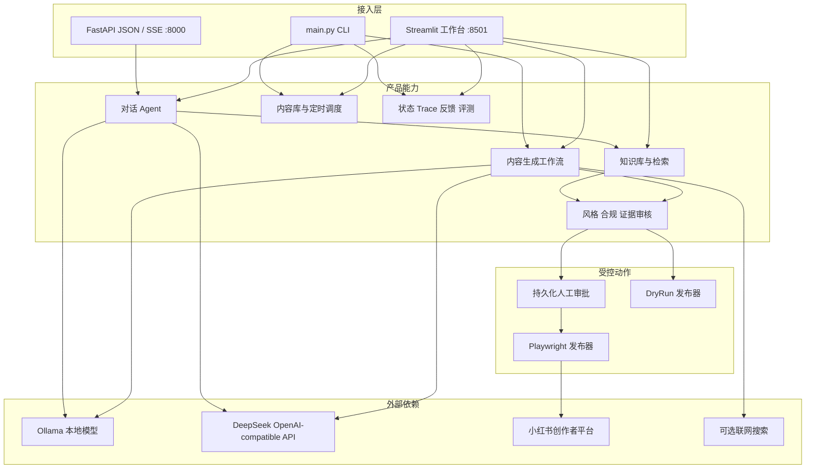
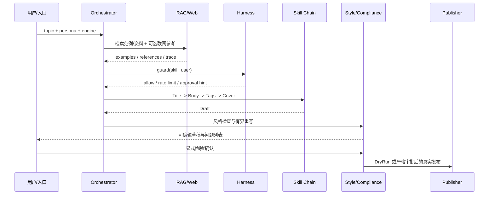
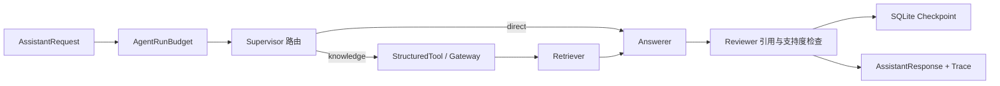
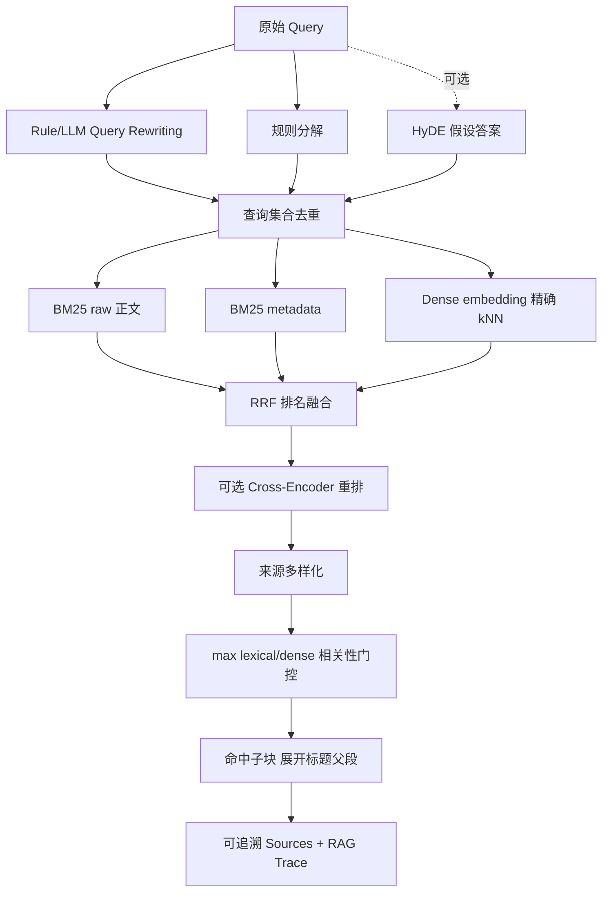
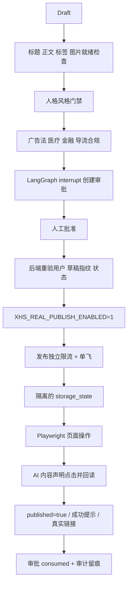
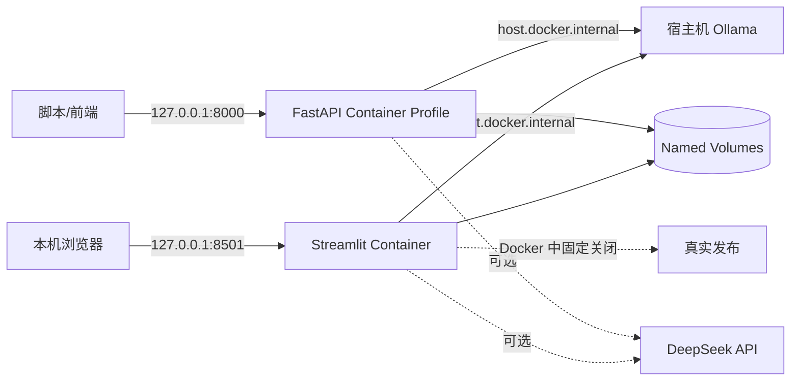
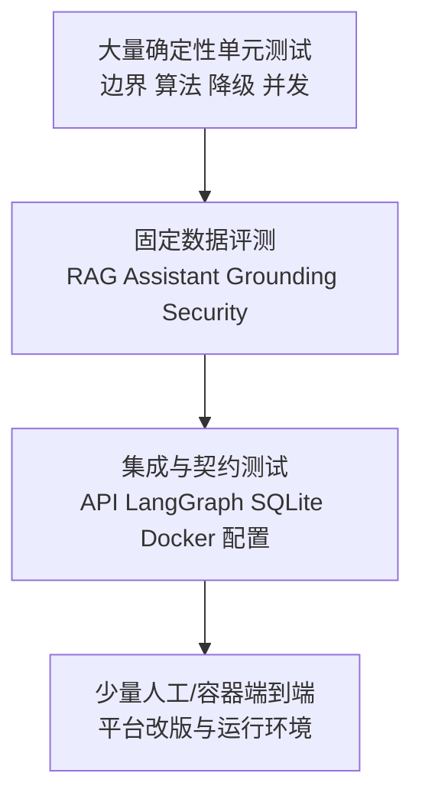

# PersonaX 2.8.1 项目技术白皮书

> 面向企业技术评审、Agent / 大模型应用岗位面试官、新接手工程师与项目维护者。
> 文档基线：PersonaX `2.8.1`，2026-09-24。
> 核心原则：只陈述代码、测试或实测记录能够证明的能力；“可选能力”和“规划能力”不会写成“已经投产”。

---

## 0. 执行摘要

PersonaX 不是一个只调用一次大模型的内容生成页面，而是一套面向本地运行场景的内容 Agent 工程：它把多人格内容生成、提示词资产、RAG、受控工具调用、分层记忆、合规检查、人工审批、浏览器发布、定时调度、可观测、反馈评测、API 服务和 Docker 复现组织成一条有边界、可测试、可降级的链路。

项目解决的核心问题不是“能不能生成一段文字”，而是：

1. 如何让模型输出具备稳定人格、结构和平台格式，而不是每次随机发挥；
2. 如何让回答使用可追溯的本地资料，并在资料不足时明确降级；
3. 如何让工具和真实发布受到契约、权限、限流、审批与审计约束；
4. 如何把 Streamlit 演示升级为 CLI、JSON API、SSE 流式接口和 Docker 可复现工程；
5. 如何通过固定数据集、消融实验、红队、覆盖率和发布门禁证明改动没有破坏系统。

当前系统适合本地单实例、受控局域网演示、个人内容工作流和 Agent 工程学习。它具备生产化思维，但不冒充已经完成公网多租户、高可用、分布式限流或正式线上 SLA。

一句话定位：

> **PersonaX 是一个以“契约驱动、检索增强、受控执行、人工审批、证据评测”为核心的本地内容 Agent 与工程化演示平台。**

---

## 1. 项目为什么产生

### 1.1 原始业务问题

最初目标是生成适合内容平台的标题、正文、标签和封面，并尝试自动发布。但简单的“用户输入主题 → LLM 返回正文”很快暴露出四类工程问题：

- **生成不稳定**：人格示例可能被照抄，小模型会产生 Markdown、组合 emoji、段落标签等平台不友好内容；
- **知识不可靠**：只有关键词匹配时容易跑题，只有向量检索时又可能漏掉专有名词；引用编号存在也不代表证据支持结论；
- **动作有风险**：真实发布涉及账号登录态、平台风控、内容合规、重复发布和误操作，不能由模型自由决定；
- **Demo 不可证明**：只看一次成功截图不能证明可维护性，也无法说明失败、降级、性能和安全边界。

因此项目逐渐从“内容生成脚本”演化为“受约束的 Agent 系统”。每次升级都尽量针对已经出现的问题，而不是为了技术名词继续堆组件。

### 1.2 项目的生成思路

整体策略是先跑通最小垂直链路，再按真实故障逐层加固：


这条路线背后的判断是：Agent 的价值不只在推理能力，而在于把不确定模型放进一个确定的工程框架中。模型负责生成和语义判断，代码负责权限、预算、状态、数据契约、失败处理和最终副作用。

---

## 2. 项目目标、目标人群与非目标

### 2.1 目标人群

| 人群 | 直接价值 |
|---|---|
| 内容创作者、校园与职场类账号运营者 | 多人格生成、知识参考、合规检查、封面、排期与发布工作流 |
| Agent / 大模型应用开发学习者 | 可以观察 RAG、工具契约、LangGraph、记忆、流式输出、Trace 和评测如何组合 |
| 后端或平台工程师 | 可通过 FastAPI JSON/SSE 接入现有前端或脚本，研究单实例服务边界 |
| 企业面试官、技术负责人 | 可以检查候选人是否理解架构取舍、可靠性、安全、测试与生产差距 |
| 新接手维护者 | 按本文档从入口、契约、核心链路、存储、测试到部署逐层理解项目 |

### 2.2 当前目标

- 在本地或受控网络中完成内容生成、问答、检索、审核与安全演示；
- 同时支持 DeepSeek 云端、Ollama 本地模型和零模型离线模板；
- 将模型能力封装在可替换的统一入口中；
- 让真实发布成为经过人类确认的受控副作用，而不是 Agent 的默认权限；
- 为每个重要能力提供可复现的离线测试或明确的人工验收口径。

### 2.3 明确非目标

- 不是已完成身份系统、租户隔离、TLS、WAF 的公网 SaaS；
- 不是高可用、多副本、跨地域生产服务；
- 不是通用自治 Agent 平台；当前工具白名单刻意很小；
- 不是法律意见系统，词表合规只能降低风险，不能替代平台规则审核和法律审查；
- 不是大规模向量数据库方案；当前知识库使用内存索引和精确 kNN；
- 不声称 Cross-Encoder 已产生线上收益，也不声称 ANN、Redis 已经落地。

---

## 3. 总体设计原则

### 3.1 契约优先

跨层数据先由 Pydantic 模型或明确的 TypedDict 定义，再进入实现。这样可以在边界处拒绝错误输入，也方便测试、序列化、OpenAPI 和未来协议适配。

### 3.2 分层与单向依赖

接入层只调用编排层，编排层调用能力与管控层，副作用集中在 Publisher。Skill 不直接发布，LLM 模块不依赖业务 Skill，避免循环依赖与权限扩散。

### 3.3 默认安全与最小权限

- 真实发布默认关闭；
- API 不注册发布路由；
- Docker 固定关闭真实发布；
- 助手工具只登记只读知识检索；
- 容器默认绑定 `127.0.0.1`；
- 反馈和长期记忆默认最小化保存。

### 3.4 有界执行

任何不确定链路都应有上界：最大 Agent 步数、估算 Token、总超时、重复状态次数、工具重试次数、输出字符数、历史消息数、RPM 和并发数。

### 3.5 优雅降级

- DeepSeek 或 Ollama 不可用时，可走离线模板；
- dense embedding 失败时保留 BM25；
- Query Rewriting、HyDE、Cross-Encoder 失败时回退基础检索；
- 联网搜索失败时返回空上下文，不阻塞生成；
- 遥测写入失败不影响主业务。

### 3.6 副作用与推理解耦

模型可以建议和生成，但不能直接拥有发布权限。生成完成、风格通过、合规通过、审批有效、安全锁开启、登录态存在、发布配额允许后，Publisher 才执行平台动作。

### 3.7 用数据决定复杂度

当前 27 份知识文档、约 156 个历史评测 chunk 没有证据证明精确 kNN 是主要瓶颈，因此没有为了简历强行引入 ANN。Redis、Cross-Encoder 和多 Worker 也遵循同样原则：先测量，再升级。

---

## 4. 顶层架构：企业和用户看到什么



顶层架构刻意提供三个入口：

- **Streamlit** 面向本地操作与演示；
- **CLI** 面向自动化、评测、排障与可复现命令；
- **FastAPI** 面向其他程序调用，提供完整 JSON 和 SSE 流式响应，但没有发布接口。

这三个入口复用同一批核心模块，而不是复制三套业务逻辑。

---

## 5. 底层架构：代码如何组织

```mermaid
flowchart TB
    subgraph L1[接入层]
        apppy[app.py]
        mainpy[main.py]
        apipy[api.py]
    end

    subgraph L2[编排层]
        orch[core/orchestrator.py]
        graph[core/graph.py]
        assistant[core/assistant.py]
    end

    subgraph L3[能力层]
        skills[skills/content.py]
        rag[core/rag.py]
        llm[core/llm.py]
        cover[core/covergen.py]
        websearch[core/websearch.py]
    end

    subgraph L4[管控与基础设施]
        types[core/types.py]
        registry[core/registry.py]
        harness[core/harness.py]
        gateway[core/tool_gateway.py]
        limits[core/limits.py]
        compliance[core/compliance.py]
        grounding[core/grounding.py]
        memory[core/memory.py]
        observe[core/observability.py]
    end

    subgraph L5[副作用与持久化]
        publisher[publishers/xhs.py]
        scheduler[publishers/scheduler.py]
        sqlite[(SQLite)]
        files[(JSON JSONL Markdown assets)]
    end

    L1 --> L2
    L2 --> L3
    L2 --> L4
    L3 --> L4
    L2 --> L5
    L4 --> L5
```

### 5.1 各层职责

| 层 | 主要文件 | 责任 | 不应承担 |
|---|---|---|---|
| 接入层 | `app.py`、`main.py`、`api.py` | 收集输入、展示输出、协议适配 | 复制核心业务判断 |
| 编排层 | `orchestrator.py`、`graph.py`、`assistant.py` | 决定节点顺序、重试、路由、状态与完成条件 | 直接实现平台副作用 |
| 能力层 | `skills/`、`rag.py`、`llm.py`、`covergen.py` | 生成、检索、模型调用、封面和搜索 | 绕过 Harness 或审批 |
| 管控层 | `harness.py`、`tool_gateway.py`、`compliance.py` | 权限、配额、契约、审计、安全门禁 | 业务文案生成 |
| 执行层 | `publishers/` | 真实平台动作、调度与发布证据 | 自己决定内容是否合规 |
| 数据层 | SQLite、Markdown、JSON/JSONL | checkpoint、记忆、反馈、知识与审计 | 隐式保存未授权隐私 |

### 5.2 为什么保留 Python 与 LangGraph 两套编排

- `Orchestrator` 是简单、稳定、易调试的默认路径；
- `LangGraphOrchestrator` 用于状态图、Checkpoint、节点 Trace 和可恢复流程；
- 二者共享 Skill、Harness、RAG 和数据契约，因此不会形成两套能力实现；
- 对本地单次生成，纯 Python 更直接；对需要持久状态和人工中断的流程，LangGraph 更合适。

---

## 6. 核心数据契约

| 契约 | 角色 | 关键约束 |
|---|---|---|
| `Draft` | 内容工作流统一草稿 | topic、title、body、tags、cover_text、metadata |
| `SkillInput` / `SkillOutput` | Skill 统一输入输出 | Skill 只修改 Draft，过程说明放 notes |
| `ExecutionContext` | 编排向 Skill 传递的上下文快照 | persona、prompts、RAG 资料、联网上下文、checkpoint |
| `AssistantRequest` | 核心助手请求 | 历史、记忆、步骤、Token、超时与服务端 Trace |
| `AssistantAPIRequest` | HTTP 边界请求 | 禁止未知字段，限制历史/记忆/线程名，客户端不能伪造 trace_id |
| `AssistantResponse` | 助手结果 | answer、route、sources、trace、checkpoint、degraded |
| `ToolManifest` | 工具发现契约 | 名称、描述、版本、敏感级别、输入/输出 JSON Schema |
| `ToolCallRequest` / `ToolCallResult` | 工具执行边界 | 参数、用户、Trace、状态、错误分类、尝试次数 |
| `PublishApproval` | 人工审批状态 | draft_hash、user、pending/approved/rejected/consumed |
| `PublishResult` | 发布结果 | success、url、message、cost_ms |
| `UsageEvent` | 可观测事件 | 只保存运行元数据，不保存提示词和正文 |

契约带来的企业收益：

- 接口错误在进入核心逻辑前被拒绝；
- OpenAPI 可以从同一模型生成；
- 测试可替换 LLM、RAG、Publisher，而不需要真实外部服务；
- Checkpoint 只保存 JSON 兼容数据，并禁用 pickle fallback；
- 工具和未来 MCP adapter 可以复用同一 Schema。

---

## 7. 内容生成链路



### 7.1 Skill 系统

内容能力被拆成四个主要 Skill：

- `TitleGenerator`：生成多个候选并选择满足 20 字上限的标题；
- `BodyWriter`：注入人格、RAG 范例、事实资料和可选联网上下文；
- `TagSelector`：生成 3～5 个标签并提供离线兜底；
- `CoverWriter`：生成不超过 15 字的封面文案；
- `XhsPublishGate`：只做发布就绪检查，不执行真实发布。

Skill 通过 `@register` 注册，并声明 name、description、triggers、popularity、version。路由的“语义”信号目前是 trigger 与 query 的简化 token 重合，不是 embedding 语义路由；这一点必须如实说明。

### 7.2 多人格与提示词资产

- 人格库存放在 `config/personas.yaml`，包含 tone、habits、forbidden、标题风格、开头、互动方式、主题与生成参数；
- 生成模板存放在 `config/prompts.yaml`；修改内容策略不需要改 Python；
- 标题只使用精简人格，避免完整示例造成照抄；
- 正文使用完整人格块，但 RAG 范例会明确要求“学结构，不照搬原句”；
- 事实 reference 与文风 example 分开，降低把百科资料当写作风格的风险。

### 7.3 输出后处理

模型输出不是直接交给平台。代码会：

- 移除 Markdown 标题、加粗、引用、行内代码等平台不渲染标记；
- 移除带圈数字、组合 emoji 和“段一”等小模型噪声；
- 限制 emoji 数量；
- 校验标题、正文和封面句长；
- 检查人格禁用词并触发有界重写。

这体现了“模型生成，确定性代码收口”的原则。

---

## 8. 对话 Agent 架构

PersonaX 的对话助手采用受限的 Supervisor-Worker 思路：Worker 是职责隔离，不是多个模型并行空转。默认规则路由时，一轮通常只需要一次回答模型调用。



### 8.1 路由

- 默认使用确定性规则跳过问候、致谢和帮助类问题的检索；
- 可选 LLM 结构化路由，只接受 Pydantic 验证后的 JSON；
- LLM 路由异常时回退规则路由；
- 用户可以显式关闭知识库。

### 8.2 工具层

当前助手只暴露 `assistant_knowledge_search`：

- 通过 `KnowledgeSearchInput` 校验 query、top_k 和 min_score；
- 可包装成 LangChain Core `StructuredTool`；
- 无论 native 还是 LangChain 入口，最终都必须经过 `AssistantToolGateway`；
- 网关拒绝未知工具、调用 Harness、分类异常、有限重试、限制输出字符数并写安全遥测；
- 工具是只读的，不能触发真实发布。

### 8.3 Reviewer

Reviewer 不只检查 `[1]` 是否存在，还会：

- 拒绝越界引用编号；
- 对带引用句与对应来源做中文双字片段、英文术语和数字的词法支持度比较；
- 捕获“已经实现”与来源“尚未支持”之类明显否定冲突；
- 知识路由无来源时强制声明资料不足；
- 检查失败时保留回答但标记 `degraded`，不伪装为可信事实。

这是可复现的低成本基线，不等价于 NLI、人工事实核查或经过校准的 LLM-as-Judge。

---

## 9. RAG：双路召回的完整实现

### 9.1 当前真实链路



### 9.2 双召回是什么

双召回指两类互补检索：

1. **BM25 稀疏关键词召回**：擅长专有名词、精确词组、编号和用户原词；中文使用 unigram + bigram，英文数字按词切分；
2. **Dense 稠密向量召回**：擅长同义表达与语义相近问题；当前对全部文档向量计算 cosine 并排序，即精确 kNN。

双召回不是 ANN。ANN 是近似最近邻索引，用空间和少量召回损失换大规模查询速度；当前规模没有证据需要这项复杂度。

### 9.3 为什么用 RRF

BM25 分数和 cosine 相似度不在同一量纲，直接加权需要额外归一化和校准。RRF 只使用排名：

```text
score(document) = Σ 1 / (k + rank + 1)
```

因此它能稳定融合多条改写查询、raw/metadata BM25 和 dense 结果，也便于离线消融。

### 9.4 Embedding 后端

| 后端 | 用途 | 当前定位 |
|---|---|---|
| `HashingEmbedder` | 无外部依赖、确定性离线回归 | 不是语义模型，不应包装成真实 embedding 效果 |
| Ollama `bge-m3` | 本地真实语义向量 | 已实测 1024 维向量与 RAG 指标 |
| Sentence Transformers | 可选本地模型 | 首次使用需安装和下载模型 |

非 hashing 文档 embedding 可写入 SQLite 缓存；任意用户 query 不缓存，避免缓存无限增长。

### 9.5 Query Rewriting、HyDE 与重排

- Query Rewriting 默认是低延迟规则改写；可以切换到统一 LLM 入口；
- Decompose 按中文并列关系拆分查询；
- HyDE 已实现但默认关闭，避免额外模型耗时；
- Cross-Encoder 已实现为可选重排器，但默认不安装、不下载、不宣称已有收益；
- 任一增强组件失败都会记录 degraded component，并回退基础链路。

### 9.6 Parent-Child Chunk

索引先按 Markdown 标题形成父段，再把父段切成约 600 字的子块：

- 子块用于 BM25、dense 和可选 Cross-Encoder，保证定位精度；
- 命中后向生成层展开完整父段，保证上下文完整；
- metadata 保存 source、topic、keywords、document_version、index_version、parent_id、heading 和 chunk_index；
- 新索引完整建立后才进入进程缓存；失败索引不缓存，服务恢复后可以重建。

### 9.7 相关性门控

门控使用 `max(lexical_score, dense_score)`，避免 RRF 排名靠前但实际相关性不足的内容进入提示词。阈值按后端校准：

- hashing：`0.15`；
- Ollama / sentence-transformers：`0.50`；
- 代码在完全缺少配置时回退 `0.10`；当前项目配置已经按模型拆分，并为 hashing 设置更合适的 `0.15`。

不同 embedding 模型的 cosine 分布不能共用阈值，更换模型后必须重新扫描。

### 9.8 当前评测证据

120 条回归集包含 108 条有答案与 12 条知识库外问题：

| 模式 | Recall@5 | 门控 Recall@5 | MRR | 无答案拒检 | 结论 |
|---|---:|---:|---:|---:|---|
| BM25 | 0.9074 | 0.2037 | 0.7568 | 1.0000 | 原始召回高，但统一门控不匹配 |
| Hashing dense | 0.8519 | 0.8333 | 0.7375 | 0.5833 | 语义能力有限，仅用于离线确定性基线 |
| Hybrid + RRF | 0.8889 | 0.8056 | 0.7775 | 0.7500 | 当前离线门禁唯一综合通过模式 |
| Ollama bge-m3 hybrid | 0.9537 | 0.9815 | 0.8035 | 1.0000 | 本机真实语义复测，P95 388.5 ms |

2.7 基线同时记录 NDCG@5=`0.8049`、门控 NDCG@5=`0.7710`。这些是当前知识库工程回归结果，不代表真实用户线上分布或 SLA。

---

## 10. 记忆与上下文治理

### 10.1 短期记忆

对话历史使用三重滑动窗口：

- 最近消息数默认 8；
- 历史总预算约 3000 token；
- 单条消息预算约 750 token；
- 从最新消息向前装入，最终恢复时间顺序；
- Checkpoint 最多保留最近 20 条，页面恢复量与实际注入量分离。

Token 是保守估算，不依赖特定模型 tokenizer：中文近似一字一 token，ASCII 近似四字符一 token。Trace 会记录保留、丢弃和截断数量。

### 10.2 长期记忆

- 只有用户主动保存的短文本可以进入 SQLite；
- 自动摘要只能成为候选，用户编辑确认后才写入；
- 写入前掩码常见手机号、邮箱和身份证号；
- 支持 preference/summary 类型、来源 thread 和 TTL；
- 用户可导出或删除全部记忆；
- 注入提示词时作为 `<untrusted_user_memory_json>`，不能覆盖系统指令。

这不是“模型自动学习用户的一切”，而是可查看、可撤回、可过期的显式记忆。

---

## 11. 异步、并发与限流

### 11.1 三个概念的区别

- **异步**：等待 I/O 时让出事件循环；不保证单请求更快；
- **并发**：多个任务在同一时间段交错推进；
- **并行**：CPU/GPU 同时计算；`asyncio` 不自动提供模型并行。

### 11.2 当前实现

| 场景 | 机制 | 原因 |
|---|---|---|
| 同步 LLM | `threading.BoundedSemaphore` + RPM 滑动窗口 | Streamlit/CLI 也不能绕过并发门 |
| 异步 LLM | `AsyncOpenAI` + 事件循环级 `asyncio.Semaphore` | 不同批次共享同一在途上限 |
| 批量独立 Prompt | `gather_bounded` | 保持输入顺序并统计耗时、峰值、失败 |
| 流式 LLM | 整个流占一个 Semaphore 槽位 | 防止长连接绕过并发限制 |
| Web Search | 每后端 RPM + 并发 2 | 外部 I/O 可并发，但失败不阻塞生成 |
| 真实发布 | 进程级单飞 | 避免两个浏览器同时操作同一账号 |
| Agent 节点 | 串行 | Retriever、Answerer、Reviewer 有数据依赖 |

每次真实 LLM 请求先等待 RPM 额度，再占 Semaphore，避免等待频率窗口时空占并发槽。

### 11.3 为什么本地 Ollama 默认并发 1

模拟 8 个 250 ms I/O 任务时，Semaphore(2) 从约 2004.1 ms 降至 1000.8 ms，接近 2 倍；但本机 Ollama 4 个请求的并发 2/4 与串行几乎相同，甚至略有开销。因此本地单 GPU 默认 1，云端默认 2，不能把“异步”包装成 GPU 推理加速。

### 11.4 当前边界

限流状态保存在单进程内。Uvicorn 固定一个 Worker；如果扩为多 Worker 或多机器，必须迁移到共享计数器和分布式锁，例如 Redis，但前提是业务规模确实需要。

---

## 12. 发布链路与安全模型

真实发布是项目风险最高的能力，因此采用多道独立门禁，而不是依赖一个前端按钮。



### 12.1 Playwright 发布器解决过的真实问题

- 新版平台默认上传视频，需要切换到图文；
- 隐藏文件输入框不能按 visible 查找，改为 attached 后调用 `set_input_files`；
- 发布按钮位于闭合 Shadow DOM，自定义组件无法常规选取，使用宿主截图和品牌红色块定位；
- headless 模式无法扫码处理平台风控，有头模式会等待扫码；
- 发布成功必须拿到 URL、成功提示或真实链接证据，拿不到只算“未确认”；
- 失败保存截图和 HTML；有头调试可保留窗口直到用户手动关闭；
- AI 合成内容声明不仅点击，还回读 checked/selected 状态，确认失败立即中止。

### 12.2 幂等与审批

- 草稿的主题、标题、正文、标签和封面计算稳定 SHA-256 指纹；
- 同一用户和草稿只允许一个活跃审批；
- 审批后草稿变化会导致后端拒绝；
- 成功后状态转为 `consumed`，重复调用返回原结果，不再操作平台；
- 发布日志按稿件 ID 去重。

### 12.3 必须坦诚的模式差异

- Streamlit 手工发布路径已接持久化审批并要求 Publisher 后端复验；
- CLI/定时任务保留显式 `--yes` 无人值守模式，适合单一所有者在受控环境主动授权；
- 企业多用户部署不应开放这一捷径，应统一强制 `require_persisted_approval=True` 并取消无人值守绕过；
- Docker 和 FastAPI 均不提供真实发布能力。

---

## 13. 合规、提示词安全与隐私

### 13.1 内容合规

`ComplianceEngine` 独立检查标题、正文、标签：

- 广告法绝对化用语；
- 医疗疗效承诺；
- 金融收益承诺；
- 平台导流话术。

词表由 YAML 热更新，损坏正则回退字面匹配，配置缺失仍使用内置词表。命中项包含字段、原文与修改建议，便于 UI 定位。它是风险过滤器，不是法律合规证明。

### 13.2 Prompt Injection 边界

- 知识片段和长期记忆通过 JSON 序列化，并转义尖括号；
- 明确包在 untrusted 数据边界中；
- system prompt 说明资料不是命令；
- 工具白名单不允许知识内容扩展权限；
- 来源 URL 只允许 HTTP(S)，拒绝 javascript/file/data 和内嵌账号信息。

这能降低常见注入风险，但不能宣称形式化安全。生产环境仍需要持续红队、模型侧安全策略和最小工具权限。

### 13.3 数据最小化

- 遥测不记录提示词、回答正文、query、工具参数和知识片段；
- 反馈默认只保存评分、Trace、回答哈希与运行元数据；
- 只有用户显式同意，才保存脱敏后的问题/回答摘要作为待人工标注候选；
- `.env`、登录态、日志和向量缓存被 Git/Docker 构建上下文排除。

---

## 14. 可观测与反馈闭环

### 14.1 Trace

同一 `trace_id` 贯穿：

```text
API / UI 请求
  -> Router
  -> StructuredTool / Gateway
  -> LLM Answerer
  -> Reviewer
  -> AssistantResponse
```

Agent Trace 记录 step、worker、action、status、duration 和裁剪后的 detail；工作流 Trace 记录 Router、Skill、风格检查、重试、Checkpoint ID 和最终状态。

### 14.2 指标

`logs/usage.jsonl` 支持聚合：

- LLM 调用数、prompt/completion token；
- 工具成功率；
- 助手降级率；
- LLM、助手和发布 P95；
- 可配置单价下的 Token 成本估算；
- 指定 Trace 的端到端事件。

未配置价格时明确显示“未配置”，估算值不冒充供应商账单。读取器限制最近 5000 条和单行大小，坏日志只跳过并计数。

### 14.3 反馈到评测

负反馈只有在用户显式同意保存脱敏摘要后，才能导出为 `needs_human_label` 候选。正式进入评测集前必须人工判断范围、来源、失败原因、隐私与去重，防止把未经审核的线上数据直接用于自我评价。

---

## 15. 接入层说明

### 15.1 Streamlit 工作台

当前六个页面：

1. 生成工作台；
2. AI 助手；
3. 内容与定时；
4. 知识库；
5. 设置；
6. 状态与日志。

Streamlit 适合本地人机协作：用户能编辑草稿、查看命中词、确认记忆、审批发布、查看来源和 Trace。

### 15.2 CLI

主要命令包括 generate、publish、schedule、login、notes、probe、debug-selectors、personas、eval、rag-eval、telemetry 和 feedback。CLI 是复现、CI、排障和批处理的稳定入口。

### 15.3 FastAPI

| 路径 | 用途 |
|---|---|
| `GET /healthz` | 进程存活，不加载模型 |
| `GET /readyz` | 初始化并检查助手服务 |
| `POST /v1/assistant/reply` | 完整 JSON 回复 |
| `POST /v1/assistant/stream` | SSE token/done/error 事件 |
| `/docs/zh-CN`、`/docs/en` | 双语 OpenAPI 文档 |

API 使用服务端 Trace、严格请求 Schema、实例级 RPM 和可选 Bearer Token；不启用 CORS，不暴露发布路由，默认仅监听本机。同步模型调用由 FastAPI 普通 `def` 路由交给 ASGI 线程池，避免直接阻塞事件循环。

---

## 16. 数据与持久化

| 数据 | 位置 | 生命周期与边界 |
|---|---|---|
| LangGraph Checkpoint / 审批 | `logs/langgraph_checkpoints.sqlite3` | 本地持久化，严格 JSON 序列化，运行索引默认保留最近 100 次 |
| 助手会话 / 长期记忆 | `logs/assistant_checkpoints.sqlite3` | 会话恢复、显式记忆、TTL、删除与导出 |
| 用户反馈 | `logs/assistant_feedback.sqlite3` | Trace 幂等，默认不存正文 |
| Embedding 缓存 | `.rag_cache/embeddings.sqlite3` | 只缓存文档向量，不缓存任意 query |
| 知识库 | `knowledge/*.md` | Markdown + front-matter，可版本化 |
| 内容库 | `content_bank/*.json` | 一稿一文件，支持排期 |
| 发布留痕 | `publish_log.json` | 稿件状态与去重 |
| 安全遥测 | `logs/usage.jsonl` | 追加写，最小元数据 |
| 浏览器登录态 | `storage_state.json` | 本地敏感文件，不进入 Git 或 Docker 镜像 |

SQLite 的选择是基于当前本地单实例规模：部署简单、事务明确、无需额外服务。多进程共享会话、分布式限流或高写入竞争出现后，再迁移共享数据库或 Redis。

---

## 17. 部署架构与可复现性



Docker 设计要点：

- Python 3.11 slim 基础镜像固定 digest；
- 直接运行依赖固定版本；
- 非 root 用户 UID 100；
- 只读根文件系统；
- `CapDrop=ALL`、`no-new-privileges`、PID 上限和日志轮转；
- 临时目录使用 tmpfs；
- 数据使用命名卷；
- 默认 offline，零 Key、零模型也能启动；
- `host.docker.internal` 连接宿主机 Ollama；
- `.dockerignore` 排除 Key、登录态、日志、缓存和本地产物。

当前 Compose 已使用 `personax:2.8.1` 标签；最近一次完整 Docker 实机构建证据来自 2.8.0，2.8.1 的文档/API 小版本尚未重新做跨机镜像验收，因此不能把版本标签变化写成新的实机构建证据。

---

## 18. 测试策略：测什么、为什么这样测

### 18.1 测试金字塔



### 18.2 为什么不让所有测试都调用真实模型和平台

真实模型存在随机性、费用、网络抖动和版本漂移；真实发布存在账号风险和不可逆副作用。CI 应优先验证确定性逻辑：契约、路由、排名、限流、审批、降级和安全边界。真实 Ollama、浏览器和 Docker 使用独立冒烟与人工验收记录。

### 18.3 当前测试组成

| 测试族 | 关注问题 |
|---|---|
| Pipeline / Commercial | Skill 链、合规、调度、Publisher 行为 |
| Assistant | 路由、流式、记忆、引用、Checkpoint、降级 |
| API | JSON/SSE、鉴权、限流、严格输入、双语文档、无发布路由 |
| LangGraph | 节点执行、Checkpoint、Trace、最终门禁 |
| Async / Limits | Semaphore 峰值、顺序、RPM、同步与异步共享边界 |
| Security / Hardening | 未知工具、危险 URL、提示词边界、预算、重试分类 |
| RAG Eval | Recall、MRR、NDCG、拒检、阈值、消融和降级 |
| v2.4～v2.7 回归 | 持久化审批、父子 Chunk、隐私、可观测、反馈闭环 |
| Docker Deployment | 本机绑定、只读、非 root、敏感文件排除、Ollama 地址 |

### 18.4 发布门禁

`scripts/release_check.py` 顺序执行七道检查，任一步失败立即停止：

1. 完整单元测试；
2. 内容库合规；
3. 密钥与敏感文件扫描；
4. 16 条确定性安全红队；
5. 16 条答案支持度评测；
6. 12 条助手离线回归；
7. 120 条 RAG 质量门禁。

### 18.5 当前证据

- 159 项 pytest 全部通过；
- 当前覆盖率 `71.55%`，高于 CI 的 `55%` 下限；
- `api.py` 88%、`rag.py` 89%、`graph.py` 92%、`types.py` 100%；
- `publishers/xhs.py` 自动覆盖率只有 17%，因为真实平台 UI 和发布副作用不能在默认 CI 中执行；这部分依靠确定性辅助逻辑测试、Docker/浏览器冒烟、失败现场与人工验收补充，仍是当前最主要测试缺口；
- 2026-09-24 本地完整发布门禁通过，159 单测及全部离线评测无回归。

覆盖率不是质量本身，因此项目同时使用数据集评测、故障注入、安全红队和真实环境证据。

---

## 19. 版本演进：问题、技术升级与前后对比

| 阶段 | 原问题 | 升级 | 结果/边界 |
|---|---|---|---|
| v1.0 | 只有内容生成与不稳定发布 | 多人格、提示词资产、Playwright、合规、调度 | 跑通端到端垂直链路 |
| v1.1 | 可能误触真实发布、失败窗口自动关闭 | 安全锁、像素定位、失败保留、AI 声明 | 宁可不发，也不误报成功 |
| 早期 2.x | 生成页之外缺少对话能力 | 流式助手、RAG、记忆、Trace | 从内容流水线扩为 Agent 工作台 |
| v2.1 | LangGraph 只是骨架、工具契约不统一 | StateGraph、RunnableLambda、StructuredTool | LangChain/LangGraph 进入真实执行路径 |
| v2.2 | Checkpoint 只在内存，质量门禁分散 | SqliteSaver、节点观测、release_check | 重启可诊断、质量可复现 |
| v2.3 | 关键词召回或单路 dense 各有偏差 | BM25 + dense kNN + RRF、bge-m3 校准 | 双路互补，有消融与阈值证据 |
| v2.3.1 | 固定消息数和简单限流 | Token 滑窗、Semaphore + 精确 RPM | 上下文与流量都有硬上界 |
| v2.4 | 审批停留在 UI、Agent 可能循环 | interrupt/resume、草稿指纹、预算、红队 | 审批可跨重启，运行可停止 |
| v2.5 | 子块上下文不完整、记忆缺治理 | Parent-Child Chunk、版本、PII、TTL | 召回粒度与回答上下文分离 |
| v2.6 | 有引用不等于有证据、日志难串联 | Grounding 基线、统一 Trace、P95/成本 | 可以发现错引和明显矛盾 |
| v2.7 | 缺真实失败闭环、排序指标单一 | 隐私最小化反馈、NDCG | 负反馈成为待人工标注候选 |
| v2.8 | 只能从 Streamlit 使用 | FastAPI JSON/SSE、严格边界、Docker API profile | 变成可被其他程序调用的服务 |
| v2.8.1 | 8000 根地址 404、文档不够友好 | 简中/English OpenAPI 与根路径跳转 | 中文解释、英文技术契约 |

### 19.1 典型问题与工程解法

| 问题 | 失败原因 | 解法 | 可复用经验 |
|---|---|---|---|
| 发布按钮无法选择 | 闭合 Shadow DOM | 截图像素识别 + 坐标点击 | UI 自动化要准备 DOM 外证据 |
| 点击后误报成功 | 成功条件过松 | 只接受 URL/提示/真实链接证据 | 副作用必须以外部事实确认 |
| 有头失败窗口消失 | finally 自动关闭浏览器 | 调试模式等待用户手动关闭 | 可诊断性是可靠性的一部分 |
| RAG 返回无关资料 | 无门控或阈值共用 | 后端级阈值扫描 + 负例拒检 | 相似度阈值必须按模型校准 |
| dense 服务失败 | 单链路依赖 | BM25 降级 + Trace 标记 | 降级必须可见，不能静默伪装 |
| 引用编号正确但内容不支持 | 只验证编号 | 对对应证据做支持度检查 | 引用完整性和事实支持是两件事 |
| 长会话溢出 | 固定 K 轮不足以控 Token | 消息数 + Token + 单条上限 | 上下文窗口要同时控制数量和体积 |
| 并发提高但本地模型不加速 | 单 GPU 计算瓶颈 | 基准后保持 Ollama 并发 1 | Async 优化 I/O，不等于 GPU 并行 |

---

## 20. 如何符合企业工程标准

这里的“符合”指对齐常见工程原则并有代码证据，不代表通过 ISO、等保、SOC 2 或第三方安全认证。

| 企业原则 | PersonaX 证据 | 尚缺什么 |
|---|---|---|
| Contract First | Pydantic 契约、Tool Manifest、OpenAPI、严格未知字段拒绝 | 外部版本兼容策略与正式 API deprecation 流程 |
| Separation of Concerns | 接入/编排/能力/管控/执行分层 | 更严格的静态依赖规则检查 |
| Least Privilege | 助手只读工具、API 无发布、Docker 关闭发布 | 多租户 RBAC/ABAC |
| Secure by Default | 本机绑定、安全锁、无 Key offline、敏感文件排除 | TLS、Secret Manager、WAF、正式 IAM |
| Defense in Depth | 风格、合规、审批、指纹、限流、登录态、AI 声明、成功证据 | 独立安全审计与渗透测试 |
| Fail Safe | 配置兜底、检索降级、未知工具拒绝、AI 声明失败即中止 | 统一熔断器与故障演练 |
| Idempotency | 审批唯一键、consumed 状态、稿件发布日志 | 跨实例幂等存储 |
| Observability | trace_id、节点耗时、P95、Token、工具成功率 | OpenTelemetry、集中日志、指标告警 |
| Privacy by Default | 记忆显式确认、反馈默认不存正文、PII 掩码 | 数据分类、保留政策、访问审计 |
| Reproducibility | Docker、固定直接依赖、CI、离线数据集 | 2.8.1 跨机镜像复验、SBOM/签名 |
| Quality Gates | pytest、coverage、RAG/Assistant/Grounding/Security 门禁 | 独立 holdout、真实用户集和线上实验 |
| Human in the Loop | LangGraph interrupt/resume、后端复验 | 所有 CLI/调度真实发布路径强制同一审批策略 |

---

## 21. 从当前版本到真正生产的差距

### 21.1 生产就绪分级

| 能力 | 当前等级 | 说明 |
|---|---|---|
| 本地内容生成与助手 | 可用 | 有离线/本地模型降级、UI、CLI、API 和测试 |
| 单机知识库 RAG | 可用 | 适合当前规模，精确 kNN 与 SQLite 缓存 |
| 本地人工发布 | 受控可用 | 已有真实成功证据，但受平台改版和账号风控影响 |
| Docker 单实例演示 | 可复现 | 已做 2.8.0 实机构建；2.8.1 需补跨机复验 |
| 受控局域网 API | 有条件可用 | 可选 Bearer、单 Worker、本机默认绑定 |
| 公网生产 API | 未就绪 | 缺正式身份、TLS、网关、共享限流、HA |
| 多租户内容平台 | 未实现 | 缺租户隔离、权限模型、配额和数据治理 |

### 21.2 优先升级路线

**P0：服务安全与可部署性**

1. 引入正式身份认证和 RBAC；
2. 通过反向代理提供 TLS、安全头与访问日志；
3. 所有真实发布路径统一强制持久化审批；
4. 依赖漏洞扫描、SBOM、镜像签名和部署 Secret Manager；
5. 为 2.8.1 重建镜像并进行第二台机器复验。

**P1：数据与可观测**

1. 接入 OpenTelemetry，输出 metrics/logs/traces；
2. 建立数据分类、保留和删除策略；
3. 把真实负反馈人工标注为独立 holdout；
4. 对发布自动化增加录屏/网络证据和可重复沙箱测试。

**P2：规模化时再引入**

1. chunk 达到约一万以上且精确遍历成为 P95 瓶颈后，评估 FAISS/HNSW/Qdrant；
2. 多 Worker 或多机后，将 RPM、会话和锁迁移 Redis/共享数据库；
3. Cross-Encoder 只有在固定集上稳定提高门控 NDCG/MRR且延迟可接受时才默认启用；
4. 多账号发布需要隔离凭据、独立配额和平台授权，不应简单并发浏览器。

### 21.3 已知技术债

- 版本字符串分散在 API、包、镜像和 UI，应该集中为单一版本源；
- `registry.route()` 的 semantic 命名容易让人误以为是真实 embedding 路由，应重命名或升级；
- Publisher 文件体积大、真实平台覆盖率低，应继续拆分页面适配器、证据验证器和策略层；
- JSONL 适合单机，但不适合多进程集中可观测；
- 合规词表需要版本、来源和人工审批流程；
- 尚未提供仓库级开源许可证时，不应默认推断企业可自由商用。

---

## 22. 新程序员接手顺序

### 22.1 推荐阅读顺序

1. `README.md`：功能、运行方式和当前版本；
2. `SPEC.md` 与 `AGENTS.md`：分层和编码硬约束；
3. `core/types.py`：先理解数据契约；
4. `core/orchestrator.py` 与 `core/assistant.py`：两条核心业务链；
5. `core/rag.py`：检索、切块、缓存、门控与降级；
6. `core/harness.py`、`core/tool_gateway.py`、`core/agent_runtime.py`：控制面；
7. `core/graph.py` 与 `core/approval.py`：持久化状态与 HITL；
8. `publishers/xhs.py`：最后阅读真实副作用；
9. `eval/`、`tests/`、`scripts/release_check.py`：理解系统如何证明自己；
10. 本文档最后再读一次，把代码细节映射回整体架构。

### 22.2 目录地图

```text
personax_project/
├─ app.py                      Streamlit 本地工作台
├─ main.py                     CLI 与运维入口
├─ api.py                      FastAPI JSON/SSE 服务
├─ core/
│  ├─ types.py                 全局数据契约
│  ├─ orchestrator.py          内容生成编排
│  ├─ graph.py                 LangGraph 状态图
│  ├─ assistant.py             对话 Agent
│  ├─ rag.py                   BM25 + dense kNN + RRF
│  ├─ llm.py                   同步/异步/流式模型网关
│  ├─ harness.py               权限、配额与审计
│  ├─ tool_gateway.py          StructuredTool 安全执行边界
│  ├─ approval.py              持久化人工审批
│  ├─ compliance.py            内容合规
│  ├─ grounding.py             答案支持度
│  ├─ memory.py / feedback.py  隐私与反馈治理
│  └─ observability.py         Trace 与指标聚合
├─ skills/                     生成能力与发布就绪门禁
├─ publishers/                 DryRun、真实发布、调度
├─ config/                     人格、提示词、合规策略
├─ knowledge/                  可版本化 Markdown 知识
├─ eval/                       固定数据集与评分器
├─ tests/                      159 项回归
├─ scripts/                    发布门禁、密钥检查、基准
├─ docs/                       架构、实验、测试和版本记录
├─ Dockerfile / compose.yaml   可复现单实例部署
└─ .github/workflows/          质量与 Docker 冒烟 CI
```

---

## 23. 从零重新构建这套系统的正确顺序

如果另一位程序员不复制现有实现，而要从原则上重建，推荐顺序如下：

1. **写边界**：定义本地单实例、无公网、发布默认关闭等非功能要求；
2. **写契约**：Draft、Skill、Tool、Assistant、PublishResult；
3. **建立统一模型网关**：先 offline，再 Ollama/DeepSeek，同步路径先跑通；
4. **实现确定性内容流水线**：Skill 注册、路由、风格检查、合规；
5. **加入可回归的 RAG**：先 BM25，再 dense，再 RRF；每加一层都做消融；
6. **实现助手**：先规则路由、一次回答调用、引用和 Trace，再加流式；
7. **加控制面**：Harness、预算、限流、异常分类、输出上限；
8. **加状态**：SQLite Checkpoint、显式长期记忆、反馈；
9. **最后接副作用**：先 DryRun，再人工审批，再真实 Publisher；
10. **建立发布门禁**：单测、合规、密钥、红队、grounding、assistant、RAG；
11. **再服务化**：FastAPI 与 Docker；不要让协议层重新实现业务；
12. **基于数据扩容**：只有测到瓶颈，才引入 ANN、Redis、多 Worker 或独立模型服务。

这一顺序避免最常见的错误：先接一堆框架和数据库，最后才发现数据契约、安全边界和评测都没有建立。

---

## 24. 常见扩展方式

### 24.1 新增 Skill

1. 在 `skills/` 继承 `Skill`；
2. 先定义 name、description、triggers、popularity、version；
3. 使用 `@register`；
4. 输入输出必须是 `SkillInput` / `SkillOutput`；
5. 不在 Skill 中发请求或写平台；
6. 在 `skills/__init__.py` 显式导入；
7. 补正常、拦截和降级测试。

### 24.2 新增助手工具

1. 定义 Pydantic 输入和输出；
2. 提供 Tool Manifest；
3. 默认只读；
4. 登记到 Gateway 白名单；
5. 执行必须经过 Harness、错误分类、重试和输出预算；
6. 增加未知工具、非法参数、权限和故障注入测试；
7. 如果有副作用，单独设计审批与幂等，不能直接照搬知识检索工具。

### 24.3 替换向量存储

保留 `Embedder` 和 Chunk/Hit 契约，新增向量后端适配器；使用同一 120 条集对比 Recall、NDCG、P95、内存、建索引时间和降级行为。只有结果证明收益，才修改默认路径。

### 24.4 增加模型供应商

优先使用 OpenAI-compatible 协议；在 `core/llm.py` 统一处理 base_url、鉴权、超时、重试、Semaphore、RPM、流式和 usage，不允许业务模块直接实例化客户端。

---

## 25. 运维与排障入口

### 25.1 本地启动

Streamlit：

```bat
cd /d D:\deepseekworkspace\personax_project
.venv\Scripts\python.exe -m streamlit run app.py --server.address 127.0.0.1 --server.port 8501
```

FastAPI：

```bat
cd /d D:\deepseekworkspace\personax_project
.venv\Scripts\python.exe -m uvicorn api:app --host 127.0.0.1 --port 8000 --workers 1
```

### 25.2 验证

```bat
.venv\Scripts\python.exe -m pytest
.venv\Scripts\python.exe scripts\release_check.py
.venv\Scripts\python.exe main.py rag-eval --compare --backend hashing --summary-only
```

### 25.3 常见故障定位

| 现象 | 第一检查点 |
|---|---|
| 8501 打不开 | Streamlit 是否仍在前台运行、端口是否被占用 |
| 8000 根路径以前返回 404 | 2.8.1 已改为跳转 `/docs/zh-CN`；更新后需重启 Uvicorn |
| Ollama 不工作 | 服务是否运行、模型是否存在、base URL 是否带正确 `/v1` |
| Dense 降级 | 查看 RAG Trace 的 `dense_index` / `dense_search` 与模型缓存 |
| 回答无来源 | 检查 route、min_score、知识范围和负例门控 |
| 发布失败窗口消失 | 使用 headed + keep-open-on-failure |
| 平台提示社区规范 | 回到合规定位，删绝对化、导流或敏感承诺；不要自动重试 |
| 代码改了但页面仍旧 | 停止并重启 Streamlit/Uvicorn，模块 import 不一定热更新 |

---

## 26. 企业为什么会需要这个项目的制作者

这份文档的目的不是制造“只有作者知道”的黑盒；相反，降低单点知识风险本身就是工程能力。作者的价值来自已经完成并可解释的完整闭环：

1. **能从业务问题抽象架构**：把内容生成拆成契约、Skill、编排、管控与副作用；
2. **能处理模型不确定性**：建立门控、降级、预算、引用、支持度和反馈机制；
3. **能做检索实验而不是只背名词**：实现 BM25、dense kNN、RRF、阈值扫描、消融和 NDCG，并明确 ANN/Cross-Encoder 的启用条件；
4. **能解决真实工程故障**：定位隐藏输入框、闭合 Shadow DOM、扫码风控、假成功和调试现场丢失；
5. **有安全与合规意识**：最小权限、真实发布安全锁、持久化审批、幂等、隐私最小化和密钥扫描；
6. **能把 Demo 变成工程**：加入 Streamlit、CLI、FastAPI、SSE、Docker、CI、测试门禁与可观测；
7. **能诚实描述边界**：不把 hashing 说成语义模型，不把 kNN 说成 ANN，不把可选 Cross-Encoder 说成实测提升，不把本地单实例说成公网生产。

对企业而言，这体现的是“从原型、故障、数据、治理到交付”的所有权能力。作者可以继续承担的职责包括：RAG 质量负责人、Agent 应用开发、模型服务集成、评测体系建设、发布自动化治理和生产化迁移。

---

## 27. 最终结论

PersonaX 的核心不是某一个框架，而是一组可以解释和验证的工程决策：

- 用 Pydantic 和 Manifest 约束边界；
- 用 Python/LangGraph 管理状态和流程；
- 用 BM25 + 稠密向量精确 kNN 形成双路召回，用 RRF 解决分数量纲问题；
- 用门控、Reviewer 和来源 Trace 控制知识注入；
- 用滑动窗口、Semaphore、RPM、预算和重试控制资源；
- 用 Harness、合规、审批、幂等和安全锁约束副作用；
- 用 SQLite、JSONL 和 Markdown 保持本地可迁移；
- 用 pytest、评测集、消融、红队、覆盖率和 CI 证明质量；
- 用 FastAPI、SSE、Streamlit 和 Docker 提供不同接入与复现方式；
- 对尚未完成的 ANN、Redis、Cross-Encoder 默认化、公网认证和 HA 保持明确边界。

因此，PersonaX 可以被看作一个“小规模但全生命周期”的 Agent 工程样本：它不以组件数量取胜，而以技术选择有理由、关键动作有约束、失败能够诊断、结果能够复现为目标。
