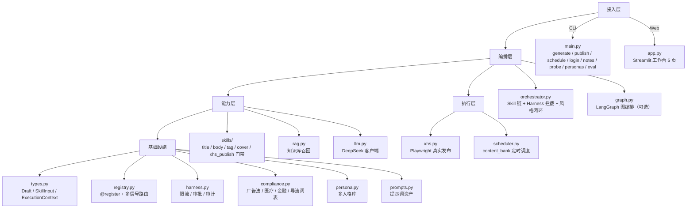
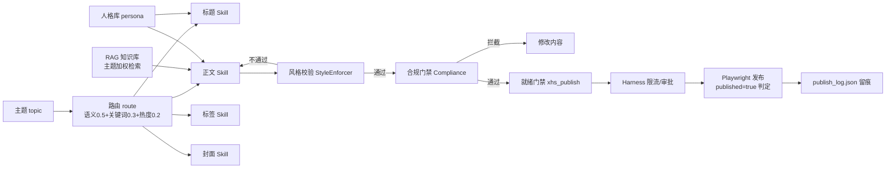
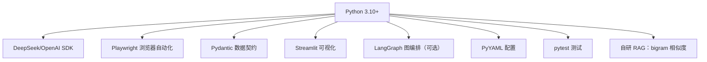

# PersonaX 知识图谱

> 本项目技术/概念地图：架构分层、核心机制、关键技术点、面试要点。
> 本文件用 Mermaid 绘制（GitHub 直接渲染）；文末附纯文本版，可复制进 Word。

## 一、架构分层图谱



## 二、生成链路图谱



## 三、核心机制要点

| 机制 | 设计 | 面试可讲点 |
|---|---|---|
| Skill 系统 | `@register` 自动注册 + 多信号加权路由 | 资产化、可插拔、manifest 标准 |
| 三层解耦 | 接入/编排/能力/执行分层，跨层只走 Draft 契约 | 为什么分层、禁止反向依赖 |
| Harness 管控 | allow/deny + 发布限速 + 敏感审批 + 审计 | 与业务解耦的规则引擎 |
| 合规引擎 | 四类词表（广告法/医疗/金融/导流）+ 正则变体 | 发布红线、fail-safe 兜底 |
| 多人格 | personas.yaml 人格库 + 与系统配置合并 | 配置驱动、热更新 |
| 提示词资产 | prompts.yaml 模板 + 占位符格式化 | 提示词工程化 |
| RAG | 中文 bigram + 主题加权 0.6/0.4 + 相关性门槛 | 中文检索适配、防跑题 |
| 真实发布 | Playwright + 登录态隔离 + 闭合 Shadow DOM 坐标点击 + published=true 判定 | 逆向排障、改版容错 |
| 幂等/限流 | publish_log 去重 + 每分钟配额 | 商用健壮性 |
| 评估闭环 | eval_set + 三维打分 + CSV | 回归保护 |

## 四、技术栈图谱



## 五、纯文本版（可复制进 Word）

```
PersonaX 知识图谱
├─ 接入层
│  ├─ main.py（CLI：generate/publish/schedule/login/notes/probe/personas/eval）
│  └─ app.py（Streamlit：生成编辑/内容库定时/知识库/设置/状态日志）
├─ 编排层
│  ├─ orchestrator.py（Skill 链 + Harness 拦截 + 风格校验闭环 + 重试）
│  └─ graph.py（LangGraph 状态图，可选）
├─ 能力层
│  ├─ skills/（标题/正文/标签/封面/发布就绪门禁，@register + 路由）
│  ├─ rag.py（知识库召回：front-matter 结构化、中文 bigram、主题加权、相关性门槛）
│  └─ llm.py（DeepSeek：重试/超时/.env 惰性依赖）
├─ 基础设施
│  ├─ types.py（Draft/SkillInput/ExecutionContext 跨层契约）
│  ├─ registry.py（Skill 注册中心 + 语义/关键词/热度加权路由）
│  ├─ harness.py（规则引擎：allow/deny、限流、敏感审批、审计）
│  ├─ compliance.py（合规引擎：广告法/医疗金融/导流词表）
│  ├─ persona.py（多人格库：list/get/resolve/add）
│  ├─ prompts.py（提示词资产：标题/正文/标签/封面模板）
│  └─ style.py（风格硬约束：禁用词/句长）
├─ 执行层
│  ├─ xhs.py（Playwright 真实发布：上传图文、shadow DOM 点击、published=true 判定、重试/幂等/截图）
│  └─ scheduler.py（定时调度：content_bank 到期检测、合规门禁、发布留痕）
└─ 资产/配置
   ├─ config/persona.yaml（默认人格 + 系统规则）
   ├─ config/personas.yaml（人格库，多人格）
   ├─ config/prompts.yaml（提示词资产）
   ├─ config/compliance.yaml（合规词表）
   ├─ knowledge/*.md（RAG 知识库，front-matter：topic/style/keywords）
   ├─ content_bank/*.json（定时稿件库）
   └─ eval/（评估闭环：eval_set + scorer）
```

## 六、一句话总结

**PersonaX = 提示词资产 × 多人格 × RAG 知识库 × 合规引擎 × 规则管控（Harness）× Playwright 真实发布 × 定时调度 × 可视化**，是一个「LLM Agent 落地到内容运营」的完整工程样例。
